# Complete Traefik Docker Setup Tutorial
## From System Boot to Running Services

This tutorial explains your entire server setup, how all components interact, and the complete flow from system startup to fully operational services.

---

## Table of Contents

1. [System Overview](#system-overview)
2. [Complete Architecture](#complete-architecture)
3. [Boot-to-Running Flow](#boot-to-running-flow)
4. [Network Architecture](#network-architecture)
5. [Container Communication](#container-communication)
6. [Request Flow (User to Service)](#request-flow-user-to-service)
7. [Certificate Management Flow](#certificate-management-flow)
8. [Data Persistence](#data-persistence)
9. [Configuration Breakdown](#configuration-breakdown)
10. [Startup Sequence Timeline](#startup-sequence-timeline)

---

## System Overview

### What You Have

Your server runs a **complete self-hosted cloud infrastructure** with:

- **Web Services**: NextCloud (file storage), n8n (workflow automation)
- **Management Tools**: Portainer (Docker GUI), Pi-hole (DNS/ad-blocking)
- **Infrastructure**: Traefik (reverse proxy), MariaDB (database)
- **Automatic HTTPS**: Let's Encrypt certificates via DNS challenge
- **Auto-Start**: Everything boots automatically when server starts

### High-Level Components


---

## Complete Architecture

### Full System Diagram

```mermaid
graph TB
    subgraph Internet
        User[👤 Users<br/>Browsers]
        DNS[🌐 DNS Queries]
    end

    subgraph "Cloudflare ☁️"
        CFDNS[DNS Records<br/>*.mabdellateef.fyi<br/>→ 197.45.95.63]
        CFAPI[Cloudflare API<br/>Token: CF_DNS_API_TOKEN]
    end

    subgraph "Router/Firewall"
        Router[Port Forwarding<br/>80 → 192.168.1.106:80<br/>443 → 192.168.1.106:443]
    end

    subgraph "Server: 192.168.1.106"
        subgraph "Traefik Container :80 :443 :8080"
            T[Traefik v2.9<br/>Reverse Proxy]
            TConfig[traefik.yml]
            ACME[(acme.json<br/>SSL Certs)]
        end

        subgraph "Application Containers"
            NC[NextCloud<br/>cloud.mabdellateef.fyi<br/>:9999]
            Port[Portainer<br/>portainer.mabdellateef.fyi<br/>:9000]
            N8N[n8n<br/>n8n.mabdellateef.fyi<br/>:5678]
            PH[Pi-hole<br/>pihole.mabdellateef.fyi<br/>:53, :80, :443]
        end

        subgraph "Backend Services"
            DB[(MariaDB<br/>Database<br/>:3306)]
        end

        subgraph "Data Storage"
            Vol1[(nextcloud_data)]
            Vol2[(mariadb_data)]
            Vol3[(portainer_data)]
        end
    end

    User -->|1. https://cloud...| CFDNS
    DNS -->|DNS lookup| CFDNS
    CFDNS -->|2. Returns IP| Router
    Router -->|3. Forward :443| T

    T -->|4. Route request| NC
    T -->|Route request| Port
    T -->|Route request| N8N
    T -->|Route request| PH

    NC <-->|SQL queries| DB

    NC -.persist data.-> Vol1
    DB -.persist data.-> Vol2
    Port -.persist data.-> Vol3

    T <-->|Certificate requests| LE[Let's Encrypt CA]
    T <-->|DNS API calls| CFAPI

    TConfig -.configures.-> T
    T -.stores certs.-> ACME

    style T fill:#FF6B6B,stroke:#C0392B,stroke-width:3px
    style User fill:#3498DB
    style CFDNS fill:#E67E22
    style LE fill:#27AE60
```



### Component Roles

| Component | Role | Ports | Dependencies |
|-----------|------|-------|--------------|
| **Traefik** | Reverse proxy, SSL termination, routing | 80, 443, 8080 | Docker socket |
| **NextCloud** | File storage and sync | 9999 (direct), 443 (via Traefik) | MariaDB |
| **Portainer** | Docker management UI | 9000 (direct), 443 (via Traefik) | Docker socket |
| **Pi-hole** | DNS server and ad blocker | 53, 80, 443 | Macvlan network |
| **n8n** | Workflow automation | 5678 (direct), 443 (via Traefik) | - |
| **MariaDB** | Database for NextCloud | 3306 (internal) | nextcloud_data volume |

---

## Boot-to-Running Flow

### Complete Startup Sequence


### Startup Timeline


**Total Boot Time: ~30-35 seconds** (from power on to fully operational)

---

## Network Architecture

### Network Topology


### Network Details

#### 1. **Bridge Network (traefik_default)**
- **Type**: Docker bridge network
- **Subnet**: 172.21.0.0/16 (auto-assigned by Docker)
- **Purpose**: Container-to-container communication
- **Isolation**: Isolated from host network
- **Containers**:
  - Traefik: 172.21.0.2
  - MariaDB: 172.21.0.3
  - Portainer: 172.21.0.4
  - n8n: 172.21.0.5
  - NextCloud: 172.21.0.6

#### 2. **Macvlan Network (pihole_net)**
- **Type**: Macvlan (direct network access)
- **Subnet**: 192.168.1.0/24 (your home network)
- **Gateway**: 192.168.1.1
- **Parent Interface**: enxf0a731b0d1fc
- **Purpose**: Pi-hole acts as a real device on your network
- **Pi-hole IP**: 192.168.1.190

**Why Macvlan for Pi-hole?**
- Pi-hole needs to answer DNS queries on port 53
- Other devices on your network need to reach it directly
- Macvlan makes it appear as a physical device

---

## Container Communication

### Internal Communication Flow

```mermaid
graph LR
    subgraph "Container Communication Patterns"
        subgraph "HTTP/HTTPS Traffic Flow"
            User[User Request]
            User -->|HTTPS :443| Traefik
            Traefik -->|HTTP :80| NextCloud
            Traefik -->|HTTP :9000| Portainer
            Traefik -->|HTTP :5678| n8n
            Traefik -->|HTTP :80| Pihole
        end

        subgraph "Database Communication"
            NextCloud -->|MySQL :3306| MariaDB
        end

        subgraph "Management Communication"
            Traefik -.Docker API.-> DockerSocket[/var/run/docker.sock]
            Portainer -.Docker API.-> DockerSocket
        end

        subgraph "DNS Traffic"
            Devices[Network Devices] -->|DNS :53| Pihole
        end
    end

    style Traefik fill:#FF6B6B
    style MariaDB fill:#00B894
    style DockerSocket fill:#FDCB6E
```

### Communication Matrix

| From | To | Protocol | Port | Purpose |
|------|--------|----------|------|---------|
| Internet | Traefik | HTTPS | 443 | Incoming web traffic |
| Traefik | NextCloud | HTTP | 80 | Proxied requests |
| Traefik | Portainer | HTTP | 9000 | Proxied requests |
| Traefik | n8n | HTTP | 5678 | Proxied requests |
| Traefik | Pi-hole | HTTP | 80 | Proxied requests (web UI) |
| NextCloud | MariaDB | MySQL | 3306 | Database queries |
| Traefik | Docker Socket | Unix Socket | - | Service discovery |
| Portainer | Docker Socket | Unix Socket | - | Container management |
| Network Devices | Pi-hole | DNS | 53 (UDP/TCP) | DNS resolution |

---

## Request Flow (User to Service)

### Complete HTTPS Request Journey


### Request Flow Breakdown

#### Phase 1: DNS Resolution (Steps 1-2)
- User types `https://cloud.mabdellateef.fyi` in browser
- Browser queries Cloudflare DNS
- Cloudflare returns your public IP: `197.45.95.63`

#### Phase 2: Network Routing (Steps 3-4)
- Browser connects to `197.45.95.63:443`
- Request hits your router
- Router forwards to internal server: `192.168.1.106:443`

#### Phase 3: SSL Termination & Routing (Steps 5-7)
- Traefik receives encrypted HTTPS request
- Decrypts using Let's Encrypt certificate
- Inspects `Host` header: `cloud.mabdellateef.fyi`
- Matches to NextCloud router (via Docker labels)

#### Phase 4: Service Processing (Steps 8-10)
- Traefik forwards unencrypted HTTP to NextCloud
- NextCloud processes request
- Queries MariaDB if needed
- Generates response

#### Phase 5: Response & Re-encryption (Steps 11-14)
- NextCloud returns HTTP response to Traefik
- Traefik re-encrypts using SSL certificate
- Sends HTTPS response back through router
- User receives encrypted response

---

## Certificate Management Flow

### Automated SSL Certificate Lifecycle


### Certificate Renewal Timeline


### DNS-01 Challenge Process


---

## Data Persistence

### Storage Architecture

```mermaid
graph TB
    subgraph "Docker Volumes (Persistent Storage)"
        Vol1[(nextcloud_data<br/>User files, configs)]
        Vol2[(mariadb_data<br/>Database files)]
        Vol3[(portainer_data<br/>Settings, stacks)]
    end

    subgraph "Bind Mounts (Host Filesystem)"
        ConfigDir[~/traefik/<br/>Configuration Files]
        LetDir[~/traefik/letsencrypt/<br/>SSL Certificates]
        DockerSock[/var/run/docker.sock<br/>Docker API Socket]
    end

    subgraph "Containers"
        NC[NextCloud]
        DB[MariaDB]
        Port[Portainer]
        Traefik[Traefik]
    end

    NC -.mounts.-> Vol1
    DB -.mounts.-> Vol2
    Port -.mounts.-> Vol3

    Traefik -.reads.-> ConfigDir
    Traefik -.reads/writes.-> LetDir
    Traefik -.reads.-> DockerSock
    Port -.reads/writes.-> DockerSock

    style Vol1 fill:#A8E6CF
    style Vol2 fill:#FFD3B6
    style Vol3 fill:#FFAAA5
    style ConfigDir fill:#E3F2FD
    style LetDir fill:#FFF9C4
```

### Data Locations

| What | Where | Type | Purpose |
|------|-------|------|---------|
| NextCloud files | `nextcloud_data` volume | Docker volume | User uploaded files, app data |
| MariaDB data | `mariadb_data` volume | Docker volume | Database files |
| Portainer data | `portainer_data` volume | Docker volume | Container configs, stacks |
| SSL Certificates | `~/traefik/letsencrypt/` | Bind mount | Let's Encrypt certificates |
| Traefik config | `~/traefik/traefik.config.yml` | Bind mount | Static configuration |
| Service definitions | `~/traefik/docker-compose.yml` | Bind mount | Container orchestration |

### What Persists After Restart?

✅ **Survives Container Restart:**
- All Docker volumes (nextcloud_data, mariadb_data, portainer_data)
- SSL certificates in letsencrypt/
- Configuration files (docker-compose.yml, traefik.config.yml)

❌ **Lost on Container Restart:**
- Container logs (unless configured otherwise)
- Temporary files inside containers
- In-memory data (caches, sessions)

---

## Configuration Breakdown

### 1. Systemd (System Level)

**File:** `/etc/systemd/system/docker.service`

```
[Unit]
Description=Docker Application Container Engine
After=network-online.target

[Service]
Type=notify
ExecStart=/usr/bin/dockerd

[Install]
WantedBy=multi-user.target  ← Enables auto-start on boot
```

**What it does:**
- Tells systemd to start Docker daemon on boot
- Runs before any containers start

### 2. Docker Compose (Orchestration Level)

**File:** `~/traefik/docker-compose.yml`

Key sections explained:

```yaml
services:
  traefik:
    image: traefik:v2.9
    restart: always  ← Automatically restart on boot/crash
    ports:
      - "80:80"      ← Map host port 80 to container port 80
      - "443:443"    ← Map host port 443 to container port 443
    volumes:
      - /var/run/docker.sock:/var/run/docker.sock:ro  ← Monitor Docker
      - ./traefik.config.yml:/etc/traefik/traefik.yml  ← Load config
      - ./letsencrypt:/letsencrypt  ← Store certificates
    environment:
      - CF_DNS_API_TOKEN=xxx  ← Cloudflare API access

  nextcloud:
    labels:
      - "traefik.enable=true"  ← Traefik should manage this
      - "traefik.http.routers.nextcloud.rule=Host(`cloud.mabdellateef.fyi`)"  ← Routing rule
      - "traefik.http.routers.nextcloud.entrypoints=websecure"  ← Use HTTPS
      - "traefik.http.routers.nextcloud.tls.certresolver=myresolver"  ← Use Let's Encrypt
```

### 3. Traefik Configuration (Proxy Level)

**File:** `~/traefik/traefik.config.yml`

```yaml
api:
  dashboard: true  ← Enable web UI
  insecure: true   ← No auth (only local access)

providers:
  docker:
    exposedByDefault: true  ← Auto-discover all containers

entryPoints:
  web:
    address: ":80"       ← Listen on port 80 (HTTP)
  websecure:
    address: ":443"      ← Listen on port 443 (HTTPS)

certificatesResolvers:
  myresolver:
    acme:
      email: "mmabdelateef@gmail.com"
      storage: "/letsencrypt/acme.json"
      dnsChallenge:
        provider: cloudflare  ← Use Cloudflare for DNS challenge
```

---

## Startup Sequence Timeline

### Detailed Boot Flow


### Boot Stages Explained

#### Stage 1: Hardware Boot (0-3 seconds)
- **BIOS/UEFI**: Power-On Self Test (POST)
- **Hardware Check**: CPU, RAM, storage
- **Boot Device**: Locate bootable drive

#### Stage 2: Bootloader (3-5 seconds)
- **GRUB**: Load GNU GRUB bootloader
- **Kernel Selection**: Choose Linux kernel
- **Initial RAM**: Load initramfs

#### Stage 3: Kernel Initialization (5-10 seconds)
- **Kernel Boot**: Start Linux kernel
- **Filesystem**: Mount root filesystem (/)
- **Drivers**: Load hardware drivers
- **Process Init**: Start first process (PID 1 = systemd)

#### Stage 4: Systemd Services (10-15 seconds)
- **Parse Units**: Read /etc/systemd/system/
- **Dependencies**: Calculate service order
- **Network**: Start networking
- **Docker**: Start docker.service (`systemctl start docker`)

#### Stage 5: Docker & Containers (15-20 seconds)
- **Docker Daemon**: Initialize Docker engine
- **Container Scan**: Find containers with restart policies
- **Traefik Start**: Launch Traefik first (dependencies)
- **App Start**: Launch all application containers

#### Stage 6: Service Configuration (20-25 seconds)
- **Docker Labels**: Traefik reads container labels
- **Routing Rules**: Build reverse proxy rules
- **Certificate Check**: Read acme.json
- **Health Checks**: Wait for containers to be healthy

#### Stage 7: Ready to Serve (25-30 seconds)
- **Ports Open**: 80, 443, 8080 listening
- **HTTPS Active**: SSL certificates loaded
- **Services**: All applications responsive

### Visual Boot Timeline

```
0s     5s     10s    15s    20s    25s    30s    35s
|------|------|------|------|------|------|------|
BIOS   Kernel Systemd Docker Traefik Config Ready
  └─POST └─Init └─Services └─Containers └─Routes └─Certs └─LIVE
```

---

## Putting It All Together

### Complete System Flow Diagram

```mermaid
flowchart TD
    Start([⚡ Power On Server]) --> BIOS[BIOS: Hardware Check]
    BIOS --> Bootloader[GRUB: Load Kernel]
    Bootloader --> Kernel[Kernel: Initialize OS]
    Kernel --> Systemd[Systemd: Start Services]

    Systemd --> CheckDocker{Docker Service<br/>Enabled?}
    CheckDocker -->|Yes| StartDocker[Start Docker Daemon]
    CheckDocker -->|No| NoAuto[Manual Start Required]

    StartDocker --> ScanContainers[Scan for Containers<br/>with restart: always]
    ScanContainers --> StartTraefik[Start Traefik Container]

    StartTraefik --> ReadTraefikConfig[Read traefik.config.yml]
    ReadTraefikConfig --> ConnectDocker[Connect to Docker Socket]

    ScanContainers --> StartApps[Start App Containers<br/>NextCloud, Portainer, etc.]
    ScanContainers --> StartDB[Start MariaDB]

    ConnectDocker --> DiscoverServices[Discover Services<br/>via Docker Labels]
    DiscoverServices --> BuildRoutes[Build Routing Rules]

    BuildRoutes --> CheckCerts{SSL Certificates<br/>in acme.json?}
    CheckCerts -->|Exist & Valid| UseCerts[Load Certificates]
    CheckCerts -->|Missing/Expired| RequestCerts[Request from Let's Encrypt]

    RequestCerts --> DNSChallenge[DNS-01 Challenge<br/>via Cloudflare]
    DNSChallenge --> ReceiveCerts[Receive Certificates]
    ReceiveCerts --> SaveCerts[Save to acme.json]
    SaveCerts --> UseCerts

    UseCerts --> ListenPorts[Listen on Ports<br/>80, 443, 8080]
    StartApps --> AppsReady[Apps Ready to Serve]
    StartDB --> DBReady[Database Ready]

    ListenPorts --> SystemReady[✅ System Fully Operational]
    AppsReady --> SystemReady
    DBReady --> SystemReady

    SystemReady --> NormalOps[Normal Operation]
    NormalOps --> DailyCheck[Daily Certificate Check<br/>09:27 UTC]
    DailyCheck --> NormalOps

    style Start fill:#E74C3C
    style BIOS fill:#F39C12
    style Kernel fill:#3498DB
    style Systemd fill:#9B59B6
    style StartDocker fill:#1ABC9C
    style StartTraefik fill:#FF6B6B
    style SystemReady fill:#2ECC71
    style NormalOps fill:#27AE60
```



---

## Quick Reference

### Key Commands

```bash
# Check if Docker auto-starts
systemctl is-enabled docker

# View system boot logs
journalctl -b

# See Docker daemon start time
systemctl status docker

# Check container uptimes
docker ps --format "table {{.Names}}\t{{.Status}}"

# View Traefik startup logs
docker logs traefik | head -50

# Check certificate expiry
docker logs traefik | grep -i "certificate"

# Test a service
curl -I https://cloud.mabdellateef.fyi
```

### Important Paths

```
/etc/systemd/system/           ← System service definitions
/var/run/docker.sock           ← Docker API socket
~/traefik/docker-compose.yml   ← Container orchestration
~/traefik/traefik.config.yml   ← Traefik static config
~/traefik/letsencrypt/         ← SSL certificates
/var/lib/docker/volumes/       ← Docker volumes data
```

### Service URLs

- Traefik Dashboard: `http://192.168.1.106:8080`
- NextCloud: `https://cloud.mabdellateef.fyi`
- Portainer: `https://portainer.mabdellateef.fyi` or `http://192.168.1.106:9000`
- Pi-hole: `https://pihole.mabdellateef.fyi` or `http://192.168.1.190/admin`
- n8n: `https://n8n.mabdellateef.fyi` or `http://192.168.1.106:5678`

---

## Summary

### What Happens When You Boot Your Server

1. **Hardware starts** → BIOS checks everything
2. **Kernel loads** → Ubuntu starts
3. **Systemd runs** → Loads all services
4. **Docker starts** → Because it's enabled
5. **Containers launch** → Because restart: always
6. **Traefik configures** → Reads configs, discovers services
7. **Certificates load** → From acme.json (or requests new ones)
8. **Everything ready** → All services accessible via HTTPS

**All of this happens automatically in ~30 seconds!**

### The Magic

- No manual intervention needed
- Survives reboots
- Handles crashes (containers auto-restart)
- Renews certificates automatically
- Discovers new services automatically

Your setup is a **self-healing, auto-starting, fully managed infrastructure** that just works! 🎉

---

**Created:** 2026-01-11
**For:** Traefik Docker Setup on 192.168.1.106
