# Complete Guide to TLS/SSL Certificates in Your Traefik Setup

## Table of Contents
1. [What are TLS/SSL Certificates?](#what-are-tlsssl-certificates)
2. [Why Do We Need Them?](#why-do-we-need-them)
3. [Understanding Let's Encrypt](#understanding-lets-encrypt)
4. [How Traefik Manages Certificates](#how-traefik-manages-certificates)
5. [The Complete Certificate Workflow](#the-complete-certificate-workflow)
6. [DNS-01 Challenge Explained](#dns-01-challenge-explained)
7. [Your Specific Setup](#your-specific-setup)
8. [Troubleshooting](#troubleshooting)

---

## What are TLS/SSL Certificates?

Think of TLS/SSL certificates like a **digital passport** for your website. Just like a passport proves your identity when traveling, an SSL certificate proves that your website is legitimate and secure.

### What They Do:

1. **Encrypt Communication** - Scrambles data between the user's browser and your server
   - Example: When you type a password, it's encrypted so hackers can't read it

2. **Verify Identity** - Proves your website is really yours
   - Prevents impersonation attacks

3. **Enable HTTPS** - The padlock icon 🔒 in the browser
   - `http://` → Insecure (no certificate)
   - `https://` → Secure (has certificate)

### Simple Analogy:

```
Without Certificate (HTTP):
You: "My password is: 123456"
Hacker: *can see everything* 👀

With Certificate (HTTPS):
You: "asdf#$%^&*jkl" (encrypted)
Hacker: *sees gibberish* ❌
```

---

## Why Do We Need Them?

### 1. **Security**
- Protects sensitive data (passwords, personal info)
- Prevents man-in-the-middle attacks

### 2. **Trust**
- Browsers show a padlock icon
- Users trust your site more
- No "Not Secure" warnings

### 3. **Required for Modern Web**
- Many browsers block features on HTTP sites
- Google ranks HTTPS sites higher
- Some services won't work without HTTPS

### 4. **Multiple Services, One Server**
In your setup, you have:
- `cloud.mabdellateef.fyi` (NextCloud)
- `portainer.mabdellateef.fyi` (Portainer)
- `pihole.mabdellateef.fyi` (Pi-hole)
- `n8n.mabdellateef.fyi` (n8n)

Each needs its own certificate to enable HTTPS!

---

## Understanding Let's Encrypt

**Let's Encrypt** is a free service that issues SSL certificates automatically.

### Traditional SSL Certificate Process (Old Way):


**Problems:**
- Expensive
- Manual process
- Time-consuming
- Easy to forget renewal

### Let's Encrypt Process (Modern Way):


**Benefits:**
- ✅ **Free** - No cost
- ✅ **Automated** - No manual work
- ✅ **Fast** - Issued in seconds
- ✅ **Auto-renewal** - Never expires

---

## How Traefik Manages Certificates

Traefik is a **reverse proxy** that:
1. Sits in front of your services
2. Handles all incoming HTTPS traffic
3. Automatically obtains and renews certificates
4. Routes requests to the correct service

### High-Level Overview:

```mermaid
graph TB
    User[👤 User's Browser] -->|https://cloud.mabdellateef.fyi| Internet
    Internet -->|Port 443 HTTPS| Traefik[🔧 Traefik<br/>Reverse Proxy]

    Traefik -->|Has valid certificate?| Check{Check Certificate}
    Check -->|Yes| Route[Route to Service]
    Check -->|No or Expiring| LE[📜 Request from<br/>Let's Encrypt]

    LE -->|DNS Challenge| CF[☁️ Cloudflare API]
    CF -->|Verified| Store[💾 Store in acme.json]
    Store --> Route

    Route -->|cloud.*| NC[NextCloud Container]
    Route -->|portainer.*| Port[Portainer Container]
    Route -->|pihole.*| PH[Pi-hole Container]
    Route -->|n8n.*| N8N[n8n Container]

    style Traefik fill:#FF6B6B
    style LE fill:#4ECDC4
    style CF fill:#F38181
    style Store fill:#95E1D3
```



### What Traefik Does Automatically:

1. **Discovers Services** - Monitors Docker containers
2. **Requests Certificates** - Contacts Let's Encrypt
3. **Completes Challenges** - Proves domain ownership
4. **Stores Certificates** - Saves in `acme.json`
5. **Serves HTTPS** - Encrypts all traffic
6. **Auto-Renewal** - Renews before expiry

---

## The Complete Certificate Workflow

### Step-by-Step: From Request to HTTPS

```mermaid
sequenceDiagram
    participant User as 👤 Browser
    participant Traefik as 🔧 Traefik
    participant LE as 📜 Let's Encrypt
    participant CF as ☁️ Cloudflare DNS
    participant NC as 📦 NextCloud

    Note over Traefik: Traefik starts up
    Traefik->>Traefik: Read traefik.yml config
    Traefik->>Traefik: Discover Docker services<br/>via labels

    Note over Traefik: Check certificates
    Traefik->>Traefik: Read acme.json
    Traefik->>Traefik: cloud.mabdellateef.fyi<br/>needs certificate

    Note over Traefik,LE: Certificate Request
    Traefik->>LE: Request certificate for<br/>cloud.mabdellateef.fyi
    LE->>Traefik: Prove you own this domain!<br/>Create TXT record:<br/>_acme-challenge.cloud.mabdellateef.fyi

    Note over Traefik,CF: DNS Challenge
    Traefik->>CF: Create TXT record via API<br/>using CF_DNS_API_TOKEN
    CF->>CF: Create DNS record
    CF->>Traefik: ✅ Record created

    LE->>CF: DNS query: Does<br/>_acme-challenge.cloud... exist?
    CF->>LE: ✅ Yes, record exists

    Note over LE: Verification Success
    LE->>Traefik: ✅ Here's your certificate!<br/>(Valid 90 days)
    Traefik->>Traefik: Save to acme.json

    CF->>CF: Auto-delete TXT record<br/>(cleanup)

    Note over User,NC: Normal HTTPS Traffic
    User->>Traefik: https://cloud.mabdellateef.fyi
    Traefik->>Traefik: Decrypt using certificate
    Traefik->>NC: Forward request (HTTP)
    NC->>Traefik: Response
    Traefik->>User: Encrypt & send (HTTPS)
```



### Simplified Flow:

1. **Traefik Starts** → Reads config, discovers services
2. **Check Certificates** → Looks in `acme.json` for existing certificates
3. **Request New** → Asks Let's Encrypt for certificate
4. **DNS Challenge** → Proves domain ownership via DNS
5. **Receive & Store** → Gets certificate, saves it
6. **Serve HTTPS** → Uses certificate for all traffic
7. **Auto-Renew** → Renews every 60 days (before 90-day expiry)

---

## DNS-01 Challenge Explained

### Why DNS Challenge?

There are 3 types of challenges Let's Encrypt uses:

| Challenge | How It Works | Use Case |
|-----------|-------------|----------|
| **HTTP-01** | Place file on web server | Public websites |
| **TLS-ALPN-01** | TLS handshake | Advanced setups |
| **DNS-01** | Create DNS TXT record | Servers behind firewall, wildcards |

You're using **DNS-01** because:
- ✅ Works even if server isn't publicly accessible on port 80
- ✅ Can issue wildcard certificates (`*.mabdellateef.fyi`)
- ✅ No need to expose additional ports

### How DNS-01 Challenge Works:


### Real Example from Your Logs:

```
time="2026-01-11T18:20:11Z" level=info
msg="Renewing certificate from LE : {Main:cloud.mabdellateef.fyi}"

What happens:
1. Traefik → Let's Encrypt: "I need a cert for cloud.mabdellateef.fyi"
2. Let's Encrypt: "Create _acme-challenge.cloud.mabdellateef.fyi with value: abc123"
3. Traefik → Cloudflare API: "Create TXT record"
4. Let's Encrypt → Cloudflare DNS: "Query: Does record exist?"
5. Cloudflare: "Yes! Here it is"
6. Let's Encrypt → Traefik: "✅ Certificate issued!"
```

### Why You Need Cloudflare API Token:

The `CF_DNS_API_TOKEN` allows Traefik to:
- Create DNS TXT records automatically
- Delete them after verification
- All without manual intervention

**Without API token:**
- You'd have to manually create TXT records
- Every 60 days for every domain
- Not practical!

---

## Your Specific Setup

### Architecture Diagram:


### Configuration Files Breakdown:

#### 1. `traefik.yml` (Static Configuration)

```yaml
# Tells Traefik HOW to get certificates
certificatesResolvers:
  myresolver:                    # Name you reference in docker labels
    acme:
      email: "mmabdelateef@gmail.com"  # Let's Encrypt notifications
      storage: "/letsencrypt/acme.json"  # Where to save certificates
      caServer: "https://acme-v02.api.letsencrypt.org/directory"  # Let's Encrypt API
      dnsChallenge:
        provider: cloudflare     # Use Cloudflare for DNS
```

**What this means:**
- Use Let's Encrypt (`caServer`)
- Use DNS challenge with Cloudflare
- Save certificates to `acme.json`
- Send notifications to your email

#### 2. `docker-compose.yml` (Dynamic Configuration)

```yaml
# Example: NextCloud service
nextcloud:
  labels:
    - "traefik.enable=true"                                    # 1. Traefik should manage this
    - "traefik.http.routers.nextcloud.rule=Host(`cloud.mabdellateef.fyi`)"  # 2. Domain name
    - "traefik.http.routers.nextcloud.entrypoints=websecure"  # 3. Use HTTPS (port 443)
    - "traefik.http.routers.nextcloud.tls=true"               # 4. Enable TLS
    - "traefik.http.routers.nextcloud.tls.certresolver=myresolver"  # 5. Use Let's Encrypt
```

**What this means:**
1. Traefik monitors this container
2. Requests for `cloud.mabdellateef.fyi` go here
3. Only accept HTTPS traffic
4. TLS is required
5. Get certificate from `myresolver` (defined in traefik.yml)

#### 3. Environment Variable

```yaml
environment:
  - CF_DNS_API_TOKEN=BDJJd2HKJOFZeISUcusxhNyZUXNDLz6heE_jUYrx
```

**What this means:**
- Traefik uses this token to talk to Cloudflare API
- Creates/deletes DNS TXT records during challenges

#### 4. `acme.json` (Certificate Storage)

```json
{
  "myresolver": {
    "Certificates": [
      {
        "domain": {"main": "cloud.mabdellateef.fyi"},
        "certificate": "base64-encoded-cert",
        "key": "base64-encoded-private-key"
      }
    ]
  }
}
```

**What this means:**
- Stores all your certificates
- One entry per domain
- Traefik reads this on startup
- Must have 600 permissions (only root can read/write)

---

## Certificate Lifecycle

### Timeline of a Certificate:


### Renewal Process:


### Renewal Frequency:

| Days Since Issue | Status | Traefik Action |
|------------------|--------|---------------|
| 0-30 | Fresh | ✅ Using certificate |
| 31-60 | Valid | ✅ Still using |
| 61-89 | Near expiry | ⚠️ Attempting renewal |
| 90+ | Expired | ❌ Certificate invalid |

**Your case:**
- Last renewal: June 20, 2025
- Current date: January 11, 2026
- Days since renewal: **204 days**
- Status: **Expired** (90 day limit passed)

---

## Troubleshooting

### Common Issues & Solutions:

#### 1. **SERVFAIL Error** (Your Current Issue)

**Error:**
```
Error renewing certificate: cloudflare: unexpected response code 'SERVFAIL'
```

**Causes:**
- Cloudflare API rate limiting
- API token issues
- DNS configuration problems
- Wildcard record conflicts

**Solutions:**

**A. Wait for Rate Limit Reset (30-60 minutes)**
```bash
# Don't restart Traefik too frequently
# Wait at least 30 minutes between attempts
```

**B. Verify Cloudflare API Token**
```bash
# Test token with curl
curl -X GET "https://api.cloudflare.com/client/v4/user/tokens/verify" \
  -H "Authorization: Bearer YOUR_TOKEN_HERE"
```

**C. Create Explicit DNS Records**

Instead of relying on wildcard (`*`), create specific A records:

| Type | Name | Content | Proxy | TTL |
|------|------|---------|-------|-----|
| A | portainer | 197.45.95.63 | DNS only | Auto |
| A | n8n | 197.45.95.63 | DNS only | Auto |

**Important:** Set to "DNS only" (gray cloud), NOT "Proxied" (orange cloud)

#### 2. **Certificates Not Renewing**

**Check:**
```bash
# View Traefik logs
docker-compose logs traefik | grep -i "renew\|acme\|error"

# Check acme.json exists and has certificates
sudo cat letsencrypt/acme.json | jq '.myresolver.Certificates[].domain'
```

**Fix:**
```bash
# Restart Traefik to trigger check
docker-compose restart traefik

# Watch logs in real-time
docker-compose logs -f traefik
```

#### 3. **Permission Denied on acme.json**

**Error:**
```
unable to get ACME account: permissions 644 for /letsencrypt/acme.json are too open
```

**Fix:**
```bash
sudo chmod 600 letsencrypt/acme.json
sudo chown root:root letsencrypt/acme.json
```

#### 4. **Certificate for Wrong Domain**

**Check Labels:**
```yaml
labels:
  # ❌ WRONG
  - "traefik.http.routers.myservice.rule=Host(`wrong-domain.com`)"

  # ✅ CORRECT
  - "traefik.http.routers.myservice.rule=Host(`cloud.mabdellateef.fyi`)"
```

#### 5. **Token Permissions Insufficient**

**Cloudflare Token Needs:**
- Permission: Zone → DNS → Edit
- Zone Resources: Include → Specific zone → mabdellateef.fyi

#### 6. **Force Fresh Certificate Request**

```bash
# Backup current certificates
sudo cp letsencrypt/acme.json letsencrypt/acme.json.backup

# Remove failed certificate entries (or delete entire file)
# Traefik will request new ones on restart

# Restart
docker-compose restart traefik
```

---

## Quick Reference

### Certificate Check Commands:

```bash
# Check certificate expiry for a domain
echo | openssl s_client -servername cloud.mabdellateef.fyi \
  -connect 192.168.1.106:443 2>/dev/null | \
  openssl x509 -noout -dates

# View all certificates in acme.json
sudo cat letsencrypt/acme.json | jq -r '.myresolver.Certificates[].domain.main'

# Check Traefik is running
docker-compose ps traefik

# View recent renewal attempts
docker-compose logs traefik | grep -E "Renewing|Error" | tail -20
```

### File Locations:

```
~/traefik/
├── docker-compose.yml          # Service definitions + Traefik labels
├── traefik.config.yml          # Static Traefik configuration
└── letsencrypt/
    └── acme.json              # Certificate storage (600 permissions)
```

### Important URLs:

- Traefik Dashboard: `http://192.168.1.106:8080`
- Let's Encrypt Status: https://letsencrypt.status.io/
- Cloudflare API: https://dash.cloudflare.com/profile/api-tokens

---

## Summary

### The Big Picture:

```
1. You run services (NextCloud, Portainer, etc.)
   ↓
2. Traefik sits in front, handling HTTPS
   ↓
3. Traefik requests certificates from Let's Encrypt
   ↓
4. Let's Encrypt challenges: "Prove you own the domain"
   ↓
5. Traefik creates DNS TXT record via Cloudflare API
   ↓
6. Let's Encrypt verifies DNS record
   ↓
7. Certificate issued, stored in acme.json
   ↓
8. Traefik uses cert to encrypt all traffic
   ↓
9. Auto-renewal every 60 days
```

### Key Takeaways:

1. **TLS certificates = Security + Trust**
2. **Let's Encrypt = Free automated certificates**
3. **Traefik = Manages everything automatically**
4. **DNS-01 Challenge = Proves domain ownership via DNS**
5. **Cloudflare API = Allows automatic DNS changes**
6. **acme.json = Where certificates are stored**
7. **Renewal = Automatic every 60 days**

### Your Current Issue:

- **Problem:** Certificates expired (7 months old)
- **Symptom:** SERVFAIL errors on portainer & n8n
- **Root Cause:** Cloudflare API rate limiting or DNS conflicts
- **Solution:** Create explicit DNS A records for failing subdomains

---

## Next Steps

1. ✅ **Understand the workflow** (You're here!)
2. ⏳ **Add explicit DNS records** for portainer and n8n in Cloudflare
3. ⏳ **Wait 2-3 minutes** for DNS propagation
4. ⏳ **Restart Traefik** to retry certificate acquisition
5. ⏳ **Verify** all certificates renewed successfully
6. ✅ **Enjoy** automatic HTTPS for all services!

---

**Need Help?**

- Check Traefik logs: `docker-compose logs traefik`
- Traefik Docs: https://doc.traefik.io/traefik/
- Let's Encrypt: https://letsencrypt.org/docs/
